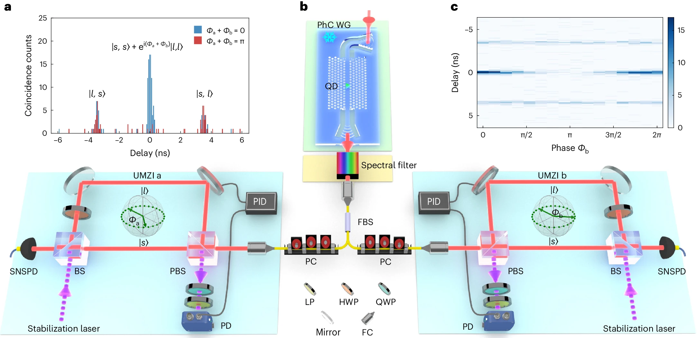
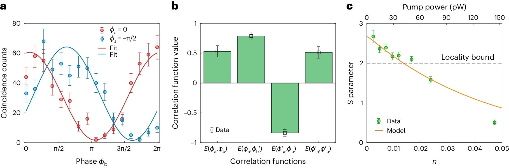

A two-level quantum dot emits photons which are entangled through two unbalanced Mach-Zehnder interferometers (UMZIs) at a relative phase $$\phi$$. The time-energy entanglement is verified by Franson interferometry showing the violation of the Clauser-Horne-Shimony-Holt (CHSH) Bell inequality.

<!--  -->
 
 
1. Photon collection from the QD 
------
The photonic-crystal waveguide (PhC WG) provides high coupling efficiency ($$\beta \approx 92%$$) between the photons emitted by the QD and the waveguide, and Purcell factor of $$F_P \approx 15.9.$$

2. UMZI superposition
------
Each UMZI superposes the photons from the short and long paths from the QD, $$\|s>$$ and $$\|l>$$, by using phases $$\phi=0$$ (blue) and $$\phi=\pi$$ (red) for the $$\frac{\|s>+e^{i\phi}\|l>}{\sqrt(2)}$$ state.

3. Biphoton Entanglement
------
Two photons from short-short $$\|s,s>$$ and long-long $$\|l,l>$$ paths are entangled into the $$\|s,s>+e^{i(\phi_a+\phi_b)}\|l,l>$$ state. By tuning the phases of UMZIs to $$\phi_a+\phi_b=0(\pi)$$, we can observe this state by the constructive (destructive) interference of the central peak (Fig. 2a).

 
3. Franson interferometry
------
By measuring the coincidence rate of the central peak at the minimum (maximum), $$R_{min} (R_{max})$$, the Franson interference visibility $$V = \frac{R_{max}-R_{min}}{R_{max}+R_{min}}$$ is fitted to be $$95(4)%$$ (Fig. 3a). 

4. CHSH
------
The CHSH $$S$$ parameter is defined as $$S=\|E(\phi_a, \phi_b)+E(\phi_a, \phi_{b'})-E(\phi_{a'}, \phi_b)+E(\phi_{a'}, \phi_{b'})\|$$, where $$E\left(\phi_a, \phi_b\right)=\frac{G^{(2)}\left(\phi_a, \phi_b\right)+G^{(2)}\left(\phi_{a \perp}, \phi_{b \perp}\right)-G^{(2)}\left(\phi_a, \phi_{b \perp}\right)-G^{(2)}\left(\phi_{a \perp}, \phi_b\right)}{G^{(2)}\left(\phi_a, \phi_b\right)+G^{(2)}\left(\phi_{a \perp}, \phi_{b \perp}\right)+G^{(2)}\left(\phi_a, \phi_{b \perp}\right)+G^{(2)}\left(\phi_{a \perp}, \phi_b\right)}$$ denotes the correlation function, and $$\phi_{a \perp}$$ and $$\phi_{a'}$$ denote the orthogonal (differing by orthogonal $$\pi$$ and diagonal phase $$\pi/2$$ basis relative to $$\phi_a$$). The experimentally found $$S=2.67>2$$ (locality bound) at a low power of $$7.2 pW$$ invalidates the Bell inquality (Fig. 3c). 